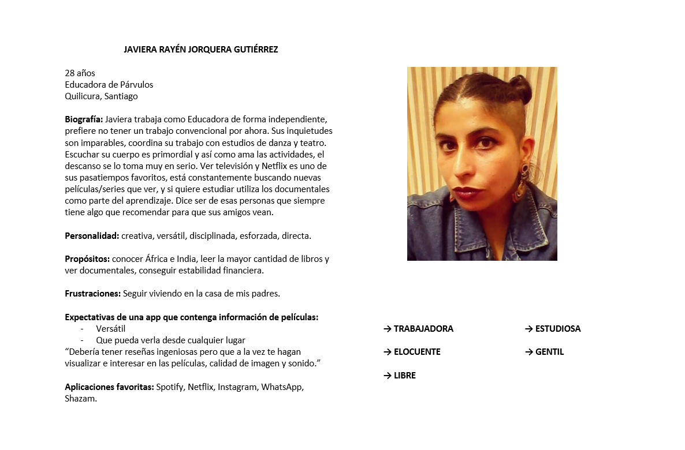
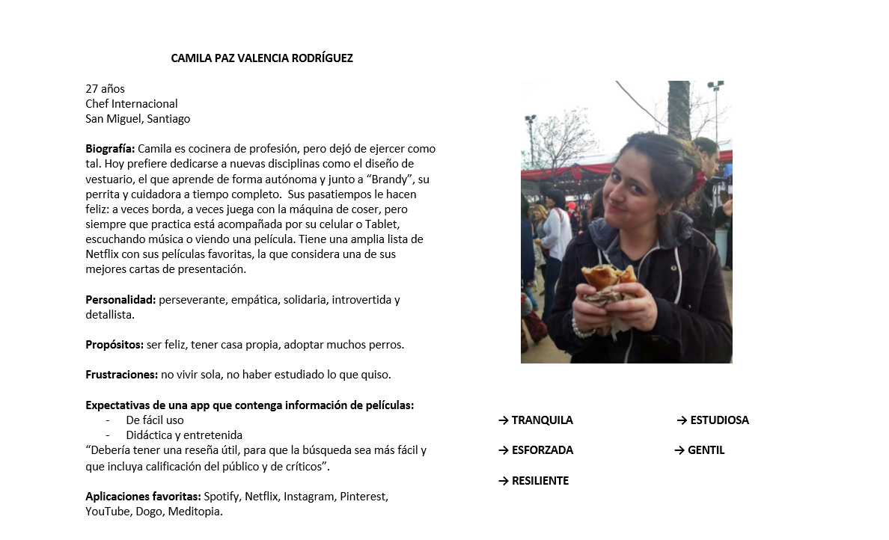
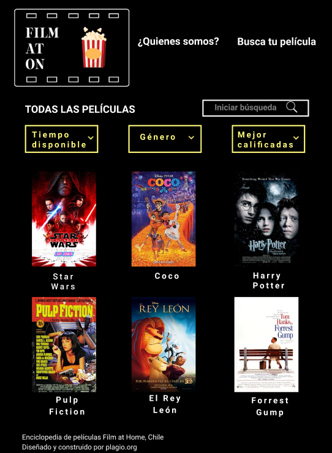
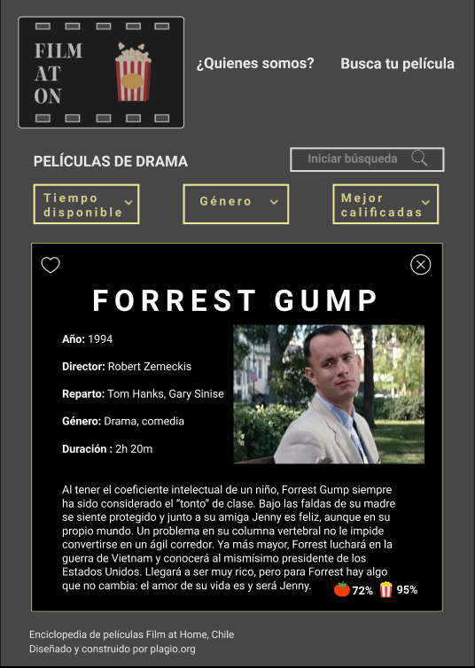

# Filmaton

**Filmaton** es una nueva aplicación que tiene como objetivo principal  entregar información específica sobre cualquier  película que el usuario o usuaria quiera ver, pudiendo escogerla según el tiempo disponible que tenga, el género que más le guste o encontrar a las mejor calificadas. 

## Planificación 

La planificación comienza reconociendo en conjunto la API de [OMDB](), la que contiene infinita información de películas y series. 

Fué fundamental identificar de qué forma los usuarios podrían aprovechar dicha información de manera atractiva y amigable, por lo que la segunda gran tarea fué dar con nuestro usuario tipo. 

### Definición: ¿Quién es nuestro usuario?

Para reconocer al usuario se realizó una [encuesta]() que obtuvo como resultado las siguientes [respuestas](): 

* La encuesta tuvo un alcance de 57 personas
* Rango de edad de nuestros usuarios: el 71,4% tienen entre 22-35 años. 
* El 98.2% disfruta de ver películas en casa. 
* Las 57 personas encuestadas utilizan la plataforma Netflix. 
* Los principales intereses del usuario para escoger una película son: el reparto (77,2%), el género (84,2%), y la reseña(56,1%).
* El 69,4% del total identifica como problema lo difícil que es escoger una película que les guste, mientras que el 24,6% se aqueja de no tener el tiempo suficiente para verlas. 
* El feedback general respecto a qué esperan de una aplicación como esta apunta a: accesibilidad, simpleza, diversidad. 

### 1° Fase de Prototipado

Una vez reconocido el usuario, comienza el proceso creativo compuesto  en primer lugar po un diagrama de flujo que grafica el flujo que debería tener la aplicación, considerando cambios de interfaces y filtración de información.

**- Prototipo de baja fidelidad**

A partir del diagrama de flujo y el reconocimiento del usuario, y por medio de lápiz y papel, se creó un boceto con las diferentes interfaces y usos que se proponen para la app web.

### User persona 

A partir de la construcción del User Persona  es posible profundizar en las necesidades de dos usuarias específicas.

Se consideran los siguientes elementos para optimizar el uso de la página:

* Saber cuáles son sus características, intereses, y gustos
* Cómo define su personalidad, en cuanto a objetivos y metas.
* Cuáles son sus aplicaciones favoritas y que espera de ellas.

### Psicología del color 

El propósito es identificar las percepciones que tienen los usuarios respecto a los colores que serán ocupados por la aplicación. Pensando en los usuarios (identificados a partir de la encuesta abierta y la utilización del user persona) e inspirado distinas aplicaciones que tratan de películas o temas relacionados al cine, la elección fue la siguiente:

**Colores base**

1. Negro: se relaciona con la sofisticación, el valor y lo atemporal. Generalmente se asocia a aplicaciones que en las que se puedan ver películas, pues simula el estar en el cine, pero desde el hogar y en cualquier momento del día. 

**Colores de contraste**

2. Amarillo: calidez, positividad, estímulos, luz. En este caso fue escogido para contrastar con el negro, simulando la tenue luz del cine. 

3. Blanco: simpleza absoluta.

### Inspiración de distintas páginas 

### Planificación mediante Historias de Usuario (HU)

**¿Cuál es la necesidad de nuestro usuario?**

### Segunda fase de Prototipado 

**- Prototipo de alta fidelidad**

Se crea utilizando la plataforma [Figma](https://www.figma.com/proto/YnrXEy8snWyLJzkDo3hEzUQw/Hackaton-Pel%C3%ADculas?node-id=1%3A2&scaling=scale-down), luego de reconocer al usuario y definir los colores, el tipo de información (a partir de la problemática) y su distribución a desplegarse en la app web. 

**- Testeo Usabilidad**

A partir de ello, se testeó a 5 usuarios con distintos intereses por las películas, quienes orientaron a mejorar la app por medio de feedback.

Las tareas a realizar fueron:

Usen las ceremonias ágiles para saber en que van como equipo, dailys y retrospectivas diarias son esenciales.

